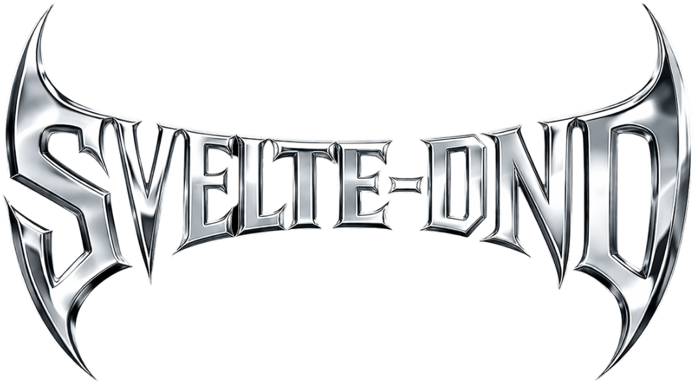

<div align="center">
  

# svelte-dnd

[](https://www.npmjs.com/package/svelte-dnd)
[](https://svelte.dev)
[](https://kit.svelte.dev)
[](https://www.typescriptlang.org)
[](https://vite.dev)
[](https://bun.sh)

</div>

A TypeScript-first, Svelte 5 drag-and-drop workspace with two focused projects:

- **`lib/`**: the publishable `svelte-dnd` package.
- **`site/`**: the local playground/docs surface for testing and demoing behavior.

## Why Svelte over React for this project?

For a drag-and-drop library like `svelte-dnd`, Svelte is a strong fit because it compiles reactivity at build time rather than relying on a heavyweight runtime reconciliation step. That keeps component logic close to the DOM behavior and makes pointer-driven interactions easier to reason about.

In practice for this repo, that means:

- less framework ceremony around rapidly changing drag state,
- direct, readable component code for hit-testing and transform updates,
- smaller integration surface for consumers who just want native-feeling DnD behavior.

React is still excellent for many apps, but for this specific package's goals (tight interaction loops, low overhead, and clean component ergonomics), Svelte gives us a simpler path.

---

## Table of Contents

- [What this repo contains](#what-this-repo-contains)
- [Prerequisites](#prerequisites)
- [Quick start](#quick-start)
- [Workspace scripts (root)](#workspace-scripts-root)
- [Library package (`lib/`)](#library-package-lib)
- [Playground site (`site/`)](#playground-site-site)
- [Typical development workflows](#typical-development-workflows)
- [Formatting and code quality](#formatting-and-code-quality)
- [Troubleshooting](#troubleshooting)

---

## What this repo contains

This repository is organized as a small Bun-powered workspace:

### `lib/` (the package)

Contains the actual `svelte-dnd` implementation, including:

- core drag/drop/editor runtime logic,
- Svelte attachment helpers,
- tests,
- package build output (`dist/`) generated from `src/lib`.

### `site/` (the playground)

Contains a Vite + Svelte app used to quickly validate behavior and iterate on UX. It depends on the local package via:

- `"svelte-dnd": "file:../lib"`

That means local package changes can be exercised in the site immediately via normal build/dev flows.

---

## Prerequisites

- **Bun** installed (recommended runtime + package manager for this repo).
- A terminal in the repository root.

Optional but recommended:

- VS Code + Svelte extension
- TypeScript tooling

---

## Quick start

From the repo root:

```sh
bun install
```

Run the playground site:

```sh
bun run site:dev
```

Build and validate the library package:

```sh
bun run lib:check
bun run lib:test
bun run lib:build
```

---

## Workspace scripts (root)

Run these from `/`:

| Script               | What it does                           |
| -------------------- | -------------------------------------- |
| `bun run dev`        | Alias to start the site in dev mode    |
| `bun run web`        | Runs `site` with Vite dev server       |
| `bun run start`      | Alias for `web`                        |
| `bun run buildweb`   | Builds the `site` app                  |
| `bun run checkweb`   | Runs type/check pipeline for `site`    |
| `bun run lib:build`  | Builds the publishable library package |
| `bun run lib:check`  | Runs Svelte/TS checks for library      |
| `bun run lib:test`   | Runs library tests                     |
| `bun run site:dev`   | Starts the site dev server             |
| `bun run site:build` | Production build for site              |
| `bun run site:check` | Type/check pipeline for site           |
| `bun run lint`       | Prettier check across workspace        |
| `bun run format`     | Prettier write across workspace        |

---

## Library package (`lib/`)

The library is published from `lib/` and uses Svelte package tooling.

### Important commands

```sh
cd lib
bun install
bun run check
bun run test
bun run build
```

### Packaging notes

- Entry points resolve to `dist/index.js` and `dist/index.d.ts`.
- `svelte-package` is used during prepack.
- `publint` is part of the packaging validation flow.

### Key directories

- `lib/src/lib/` – source code for runtime, attachments, and presets.
- `lib/dist/` – generated distribution output.

---

## Playground site (`site/`)

The site is a lightweight app for trying interactions and validating changes.

### Important commands

```sh
cd site
bun install
bun run dev
bun run check
bun run build
```

### Why this is useful

- Fast iteration loop for drag-and-drop behavior.
- Gives a concrete surface for QA before publishing package updates.

---

## Typical development workflows

### 1) Work on package internals

1. Start in `lib/src/lib`.
2. Run checks/tests frequently:
   - `bun run lib:check`
   - `bun run lib:test`
3. Build package output:
   - `bun run lib:build`

### 2) Validate in the playground

1. Start the site dev server:
   - `bun run site:dev`
2. Re-test interactions after library changes.
3. Produce a production build when ready:
   - `bun run site:build`

### 3) Final quality pass before merge

1. `bun run lint`
2. `bun run lib:check`
3. `bun run lib:test`
4. `bun run site:check`
5. `bun run site:build`

---

## Formatting and code quality

This repo uses Prettier at the root and in subprojects.

- Validate formatting:

  ```sh
  bun run lint
  ```

- Auto-format:

  ```sh
  bun run format
  ```

---

## Troubleshooting

### `bun run site:dev` fails to start

- Ensure dependencies are installed at root and (if needed) within `site/`.
- Re-run `bun install` from root.

### Type/check failures

- Run `bun run lib:check` or `bun run site:check` directly for clearer project-specific output.

### Library changes not reflected in playground

- Rebuild package with `bun run lib:build`.
- Restart `bun run site:dev` if module graph caching is stale.

---

If you want, I can also add:

- a **Getting Started (consumer)** section showing how an external Svelte project installs/uses `svelte-dnd`,
- an **API section** generated from the current exports in `lib/src/lib/index.ts`,
- and a **release checklist** for publishing changes safely.
